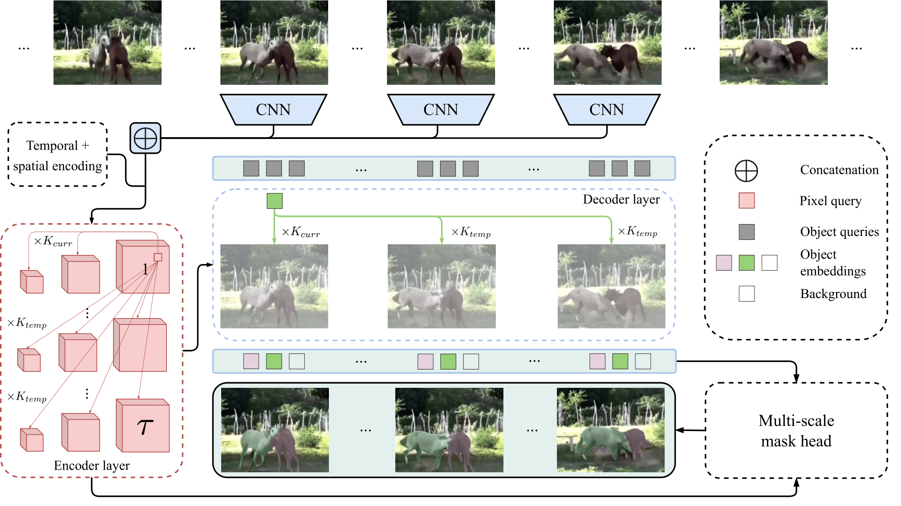
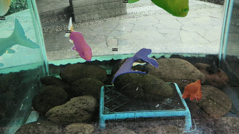
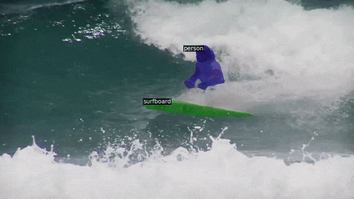
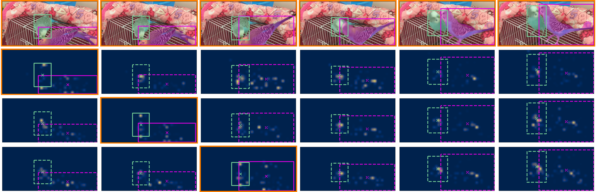

# DeVIS: Making Deformable Transformers Work for Video Instance Segmentation

This repository provides the official implementation of the [DeVIS: Making Deformable Transformers Work for Video Instance Segmentation](https://arxiv.org/abs/2101.02702) paper by Adria Caelles, [Tim Meinhardt](https://dvl.in.tum.de/team/meinhardt/), [Guillem Brasó](https://dvl.in.tum.de/team/braso/) and  [Laura Leal-Taixe](https://dvl.in.tum.de/team/lealtaixe/). The codebase builds upon [Deformable DETR](https://github.com/fundamentalvision/Deformable-DETR), [VisTR](https://github.com/Epiphqny/VisTR) and [TrackFormer](https://github.com/timmeinhardt/trackformer).

<!-- **As the paper is still under submission this repository will continuously be updated and might at times not reflect the current state of the [arXiv paper](https://arxiv.org/abs/2012.01866).** -->

<div align="center">
    
</div>

## Abstract
Video Instance Segmentation (VIS) jointly tackles multi-object detection, tracking, and segmentation in video sequences. 
In the past, VIS methods mirrored the fragmentation of these subtasks in their architectural design, hence missing out on a joint solution. 
Transformers recently allowed to cast the entire VIS task as a single set-prediction problem. Nevertheless, the quadratic complexity of existing Transformer-based VIS methods requires long training times, high memory requirements, and processing of low-single-scale feature maps.
Deformable attention provides a more efficient alternative but its application to the temporal domain or the segmentation task have not yet been explored.
In this work, we present Deformable VIS (DeVIS), a VIS method which capitalizes on the efficiency and performance of deformable Transformers. 
To reason about all VIS subtasks jointly over multiple frames, we present temporal multi-scale deformable attention with instance-aware object queries.
We further introduce a new image and video instance mask head which exploits multi-scale features, and perform near-online video processing with multi-cue clip tracking.
DeVIS benefits from comparatively small memory as well as training time requirements, and achieves state-of-the-art results on the YouTube-VIS 2019 and 2021, as well as the challenging OVIS dataset.

# Results
Click on the evaulation benchmark you want to see!
<details><summary>COCO</summary><p>

| Model                                                        | AP   | AP50 | AP75 | APl  | APm  | Aps  | FPS  |
|--------------------------------------------------------------|------|------|------|------|------|------|------|
| [Mask R-CNN](https://github.com/facebookresearch/detectron2) | 37.2 | 58.5 | 39.8 | 53.3 | 39.4 | 18.6 | 21.4 |
| Ours                                                         | 38.0 | 61.4 | 40.1 | 59.8 | 41.4 | 17.9 | 12.1 |
</p></details>

<details><summary>YouTube-VIS-2019</summary><p>

| Model                                             | AP   | AP50 | AP75 | AR1  | AR10 | FPS   |
|---------------------------------------------------|------|------|------|------|------|-------|
| [VisTR](https://github.com/Epiphqny/VisTR)        | 36.2 | 59.8 | 36.9 | 37.2 | 42.4 | 69.9  |
| [IFC](https://github.com/sukjunhwang/IFC)         | 41.2 | 65.1 | 44.6 | 42.3 | 49.6 | 107.1 |
| [SeqFormer](https://github.com/wjf5203/SeqFormer) | 45.1 | 66.9 | 50.5 | 45.6 | 54.6 | -     |
| Ours (T=6, S=4)                                   | 44.4 | 67.9 | 48.6 | 42.4 | 51.6 | 18.4  |
</p></details>

<details><summary>YouTube-VIS-2021</summary><p>

| Model                                             | AP   | AP50 | AP75 | AR1  | AR10 |
|---------------------------------------------------|------|------|------|------|------|
| [IFC](https://github.com/sukjunhwang/IFC)         | 35.2 | 57.2 | 37.5 | -    | -    |
| [SeqFormer](https://github.com/wjf5203/SeqFormer) | 40.5 | 62.4 | 43.7 | 36.1 | 48.1 |
| Ours (T=6, S=4)                                   | 41.9 | 64.8 | 46.0 | 37.3 | 48.5 |
</p></details>


 <details><summary>OVIS</summary><p>

| Model           | AP   | AP50 | AP75 | AR1  | AR10 |
|-----------------|------|------|------|------|------|
| Ours (T=6, S=4) | 23.2 | 44.0 | 21.7 | 11.8 | 27.9 |
</p></details>

## Configuration
Our configuration system is based on [YACS](https://github.com/rbgirshick/yacs) (similar as [detectron2](https://github.com/facebookresearch/detectron2)).
We hope this allows the research community to more easily build upon our method. 
Refer to `src/config.py` to get an overview of all the configuration options available including how the model is built, training and test options.
All the default config values correspond to the [Deformable DETR + iterative bounding box refinement](https://github.com/fundamentalvision/Deformable-DETR/blob/main/configs/r50_deformable_detr_plus_iterative_bbox_refinement.sh) model, making easier for the user to understand the changes we have introduced upon it. 
On the other hand, config values that are unique to DeVIS are set to YT-19 model.
We use uppercase words (e.g. `MODEL.NUM_QUERIES`) to refer to config parameters.

# Install
We refer to our [docs/INSTALL.md](docs/INSTALL.md) for detailed installation instructions.

# Train
We refer to our [docs/TRAIN.md](docs/TRAIN.md) for detailed training instructions.

# Evaluate
To evaluate model's performance, you just need to add the `--eval-only` argument and set `MODEL.WEIGHTS` to the checkpoint path via command line.
For example, the following command shows how to obtain YT-19 val predictions:
```
python main.py --config-file configs/devis/devis_R_50_YT-19.yaml --eval-only MODEL.WEIGHTS /path/to/yt-19_checkpoint_file
```
We also support multi GPU test, so you only need to set `--nproc_per_node` to the number of GPUs desired.
```
torchrun --nproc_per_node=4 main.py --config-file configs/devis/devis_R_50_YT-19.yaml --eval-only MODEL.WEIGHTS /path/to/yt-19_checkpoint_file
```

Furthermore, we have added the option to validate several checkpoints once the training finishes by simply pointing `TEST.INPUT_FOLDER` to the output training directory and `TEST.EPOCHS_TO_EVAL` to the epochs you want to validate.

## Visualize results
When `TEST.VIZ.OUT_VIZ_PATH=path/to/save` is specified, the visual results from the .json file will be saved.
Additionally, `TEST.VIZ.SAVE_CLIP_VIZ` allows saving results from the sub-clips (without the clip tracking being involved). Finally, `TEST.VIZ.SAVE_MERGED_TRACKS=True` plots all tracks on the same image (same as figures from the paper).

We provide an additional [config file](configs/devis/devis_R_50_visualization_YT-21.yaml) that changes thresholds to get more visual appealing results as well as `TEST.VIZ.VIDEO_NAMES` to infer only the specified videos (the ones shown below). 
The following command shows how to get visual results from YT-19 val set:

```
python main.py --config-file configs/devis/devis_R_50_visualization_YT-19.yaml --eval-only MODEL.WEIGHTS /path/to/yt-19_checkpoint_file
```
To generate the video, you just need to then enter to the output folder containing all the images and use:

```
ffmpeg -framerate 5 -pattern_type glob -i '*.jpg' -c:v libx264 -pix_fmt yuv420p out.mp4
```

<div align="center">
    
    
</div>


## Attention maps
We also provide an additional script `visualize_att_maps.py` to generate attention maps.
We recommend using the aforementioned visualization config file.
The script allows to choose the decoder layer as well as whether to merge resolutions or not, see  *args_parse()* for more info.
```
python visualize_att_maps.py --config-file configs/devis/devis_R_50_visualization_YT-19.yaml  MODEL.WEIGHTS /path/to/yt-19_checkpoint_file
```
<div align="center">
    
</div>